# Force Equal AI - Strategic Planning Platform 🚀

**Force Equal AI (PlanAI)** is an advanced, multi-agent AI framework built on Next.js. It transforms high-level user ideas into structured, professional execution plans. It features a conversational "Expert Observation" agent layer that asks clarifying questions before orchestrating a swarm of specialized AI agents (Planner, Insight, Execution) to generate actionable deliverables.

## ✨ Features
- **Multi-Turn Chat Interface:** An initial interactive chat assesses the feasibility of the idea, asks clarifying questions, and gathers critical context before execution.
- **Agentic Swarm Workflow:** Bypasses basic "single-prompt" AI generation. Instead, a pipeline of specialized agents process, analyze, and enrich the data sequentially.
- **Pixel-Perfect UI:** Built with Tailwind CSS v4, Framer Motion, Aceternity UI, and Magic UI for a stunning, premium, and highly responsive user experience.
- **Robust Export System:** Native DOCX generation using XML parsing, and visually-perfect PDF exports that preserve the aesthetic web styling utilizing client-side canvas rendering.
- **Section-Level Editing:** Specialized editing agents allow refinement of specific sections within the generated report without regenerating the entire document.

## 🛠️ Tech Stack
- **Framework:** Next.js (App Router), React 19
- **Styling:** Tailwind CSS v4, global CSS keyframes
- **UI Components:** Shadcn UI, Aceternity UI, Magic UI, Framer Motion
- **AI Integration:** Google Generative AI (`@google/generative-ai`)
- **Document Export:** `docx`, `jspdf`, `html-to-image`, `html2pdf.js`

## 🏗️ Architecture
The application maintains a strict separation of concerns, isolating AI logic from the frontend rendering hierarchy:

```plaintext
force-equal-ai/
├── app/                      
│   ├── api/                  # Backend API routes
│   │   ├── plan/             # Entry point for Swarm Orchestrator and Chat
│   │   ├── edit/             # Section-level AI refinement logic
│   │   └── export/           # PDF and DOCX specialized generation routes
│   ├── report/               # Execution dashboard and visualization pages
│   └── page.tsx              # Landing page with interactive Chat UI
├── components/               # Pure React UI Components
│   ├── magicui/              # Magic UI components (e.g., Shimmer Button)
│   └── ui/                   # Shadcn and Aceternity components
└── lib/                      
    ├── agents/               # AI Swarm Agent Implementations
    │   ├── planner.ts        # Deconstructs raw ideas into problem/stakeholders
    │   ├── insight.ts        # Evaluates risks and generates unique insights
    │   └── execution.ts      # Synthesizes action plans, timelines, and budgets
    ├── gemini.ts             # Google GenAI bindings, Prompt Injection Guards, Expert agent
    └── orchestrator.ts       # Orchestrates the sequential multi-agent pipeline
```

## 🤖 How the Agents Work (End-to-End Workflow)

The platform bypasses standard generation by orchestrating a swarm of agents that build upon each other's outputs:

```mermaid
sequenceDiagram
    actor User
    participant Chat as Expert Chat API
    participant Orch as Orchestrator
    participant Planner as Planner Agent
    participant Insight as Insight Agent
    participant Exec as Execution Agent
    participant UI as Report UI
    
    User->>Chat: Submits Project Idea
    Chat-->>Chat: Validates & Sanitizes Input
    alt Needs Clarification
        Chat-->>User: Asks Clarifying Questions
        User->>Chat: Provides Answers
    end
    Chat->>Orch: Status: READY + Context
    
    rect rgb(30, 41, 59)
    note right of Orch: Swarm Execution Pipeline
    Orch->>Planner: 1. Generate Problem Breakdown
    Planner-->>Orch: PlannerOutput (JSON)
    Orch->>Insight: 2. Analyze Risks & Strategies
    Insight-->>Orch: InsightOutput (JSON)
    Orch->>Exec: 3. Synthesize Final Report
    Exec-->>Orch: ExecutionOutput (JSON)
    end
    
    Orch-->>UI: Complete Execution Payload
    UI-->>User: Renders Dashboard (DOCX/PDF ready)
```



1. **Expert Observation Agent (Chat):** Activated via `/api/plan`. Uses `analyzeProjectPrompt()` to validate the user's idea. If the idea is ambiguous, it responds with clarifying questions (`CLARIFY` status). If valid, it proceeds (`READY` status).
2. **Planner Agent:** Taking the enriched problem and the user's answers, it processes the vision and outputs a detailed `problemBreakdown` alongside a list of key `stakeholders`.
3. **Insight Agent:** Analyzes the Planner's output to calculate hidden dependencies, identifying `risks`, and generating deep strategic `insights` that are not immediately obvious.
4. **Execution Agent:** Takes outputs from both the Planner and Insight agents to synthesize a comprehensive executive report. This includes `solutionApproach`, `actionPlan`, `estimatedTimeline`, `budgetEstimate`, `infrastructureRequirements`, and a production-ready `endToEndPlan`.
5. **Editing Agent:** Post-generation, users can target individual sections of the report. This agent rewrites targeted isolated text blocks based on new refinement prompts provided by the user.

### Orchestration Flow & Data Passing
The orchestration logic (`lib/orchestrator.ts`) is triggered via the `/api/plan` route. It chains the agents sequentially: **Planner** → **Insight** → **Execution**. Each agent's output is parsed strictly into JSON and directly injected as context into the next agent in the swarm. This ensures structured data passing and prevents context loss across the pipeline.

### How Section-Level Editing Works
Users can target individual sections of the generated report (e.g., Problem Breakdown) using the UI. When an edit instruction is submitted, the frontend triggers the Edit API (`app/api/edit/route.ts`). Instead of regenerating the entire document, the API isolates the section content and uses Gemini to rewrite only that specific text block. This approach significantly reduces latency and token usage while maintaining the rest of the report's structural integrity.

### How the Export System Works
Force Equal AI supports exporting the generated plans into two formats:
- **Server-Side DOCX:** Handled via the `/api/export/docx` route, the application dynamically generates a native Word document using the `docx` library. It creates structured paragraphs and headings from the JSON report data and returns it as a downloadable attachment stream.
- **Client-Side PDF:** PDF generation is handled directly within the frontend component (`ReportDashboard.tsx`). To preserve the pixel-perfect Tailwind CSS v4 styling, complex colors, and global CSS keyframes, the application uses `html-to-image` to render the DOM into a high-quality JPEG which is then embedded into a PDF using `jspdf`. This visually-perfect approach circumvents the heavy infrastructure needs of running server-side headless browsers like Puppeteer on edge environments.

## 🧠  Engineering Perspective

For rigorous, enterprise-grade deployments, Force Equal AI implements numerous advanced architectural patterns to ensure high availability, security, and extensibility:

### 1. Swarm Fault Tolerance & Edge Case Recovery
- **Non-Deterministic Safeguards:** GenAI outputs are inherently unpredictable. The orchestrator enforces strict JSON parsing boundaries. If an agent (e.g., Planner) produces malformed JSON, the pipeline includes retry mechanisms and structural integrity fallbacks.
- **Contradiction Resolution:** The Insight and Execution agents are prompt-engineered to handle impossible or contradictory user constraints (e.g., "build a massive platform for free in two days") by explicitly calculating realistic alternative timelines and flagging the contradiction, rather than hallucinating impossible results.

### 2. Security & Prompt Injection Defense
- **Early-Stage Sanitization:** Found in `lib/gemini.ts`, `promptInjectionGuard` acts as a deterministic middleware layer. It intercepts known adversarial patterns (e.g., "ignore all previous instructions") and regex-matches malicious payloads before any expensive LLM token execution occurs.
- **Role-Based Execution Isolation:** Agents do not share context freely. The Planner only receives the sanitized problem. The Execution agent only receives the strictly parsed JSON outputs of the Planner and Insight modules. This prevents prompt-leaking across the swarm.

### 3. State Management & Multi-Turn Latency
- **Optimistic UI & Hydration:** During the conversational phase, the Next.js frontend employs optimistic state updates to provide $<200$ms perceived latency, masking the $1-3$ second LLM inference time.
- **Stateless Orchestration:** The backend (`/api/plan`) is entirely stateless. Conversation history is managed client-side and passed iteratively in the payload, allowing the Next.js API route to be deployed on Edge networks without relying on persistent server memory or Redis caching.

### 4. Extensibility: Adding New Agents
The linear pipeline (`orchestrator.ts`) is designed for O/C (Open/Closed) compliance. To add a new agent (e.g., a "Financial Analysis Agent"):
1. Create `financial.ts` inheriting the base `generateJsonContent` utility.
2. Define the exact TypeScript interface (`FinancialOutput`).
3. Inject it into `orchestratePlanning` between the Insight and Execution phases and pass the output to downstream consumers.

### 5. Key Decisions & Tradeoffs
- **Client-Side PDF vs. Server-Side Puppeteer:** Rendering PDFs on the client trades off the ability to generate documents in the background for significantly lower server costs and perfect preservation of complex CSS designs. It avoids the heavy infrastructure requirements of running headless Chrome on Edge networks.
- **Stateless Orchestration vs. Redis:** Conversation history and session state are managed entirely client-side. Iterative payloads are passed to the backend, enabling the Next.js API routes to remain completely stateless. This allows for seamless deployment on Vercel Edge networks without requiring external caching architectures.
- **Sequential Swarm vs. Single Prompt:** Splitting generation into Planner, Insight, and Execution agents slightly increases overall latency but dramatically reduces LLM hallucination. It forces the AI to "think step-by-step" in discrete, verifiable chunks before synthesizing the final executive report.

## 🚀 Getting Started

### Prerequisites
- Node.js (v20+)
- Google Gemini API Key

### Installation

```bash
# 1. Clone the repository
git clone https://github.com/WizardGeeky/Force-Equal-AI.git
cd Force-Equal-AI

# 2. Install dependencies
npm install

# 3. Add your Google Gemini API key to your environment variables
echo "GEMINI_API_KEY=your_key_here" > .env

# 4. Start the Next.js Turbo Dev Server
npm run dev
```

## 👨‍💻 Author

**Force Equal AI Team**  
*Strategic Planning Agent System*  
- GitHub: [@WizardGeeky](https://github.com/WizardGeeky)
- Website: [Portfolio](https://eswarb.vercel.app)
